  

# Ali Alfridawi

**`Electrical Engineering Student at The University of Texas at Arlington`** 

  
  
  
  

I am a freshman in Electrical Engineering at the University of Texas at Arlington, with strong interests in research, photonics, and signal processing. As I continue developing my programming skills, I’m committed to creating clear, well-structured documentation for both personal and academic projects using GitHub. I am eager to learn, collaborate, and connect with others in engineering and research communities, and I’m open to networking and new opportunities.

#

### Connect with Me

  
  

#

### Languages and Tools 

  
  
  
  
  
  
  
  
  
  
  
  
  
  
  
  
  
  
  

  
  

#

### GitHub Stats

## My Stats

#

  

  

